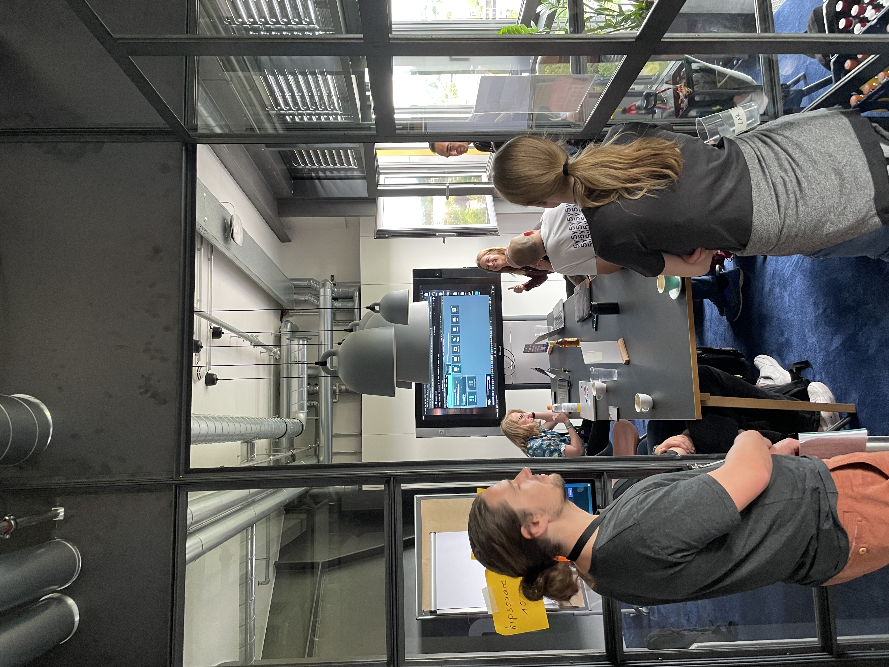

# Automated Accessibility Testing

## Part 1: Automate A11y Tests and integrate them in your CI pipeline (Vero)

My name is Vero, I work as a Software Engineer at [MaibornWolff](https://www.maibornwolff.de/)

During Part 1 of this session I took my fellow coders through an example how I set up up automated accessibility tests.

The steps and the code can be found in this repo: 
https://github.com/veronika-hillebrand-mw/axe-core-react-demo

Thanks to everyone who came and made the session fun ❤️

## Part 2: Open discussion about A11y testing (Sophia)

#### How can we go beyond the basic tests and automate something like tests for screenreader accessibility?
So far, noone has tests like this in place. However, there is a manual way of testing this by using the "Guided Tests" in the [Axe DevTools](https://www.deque.com/axe/devtools/)

People also recommended constructing tests using the [Playwright Codegen Tool](https://playwright.dev/docs/codegen), since it uses compliant selectors - for example: roles instead of test-ids.