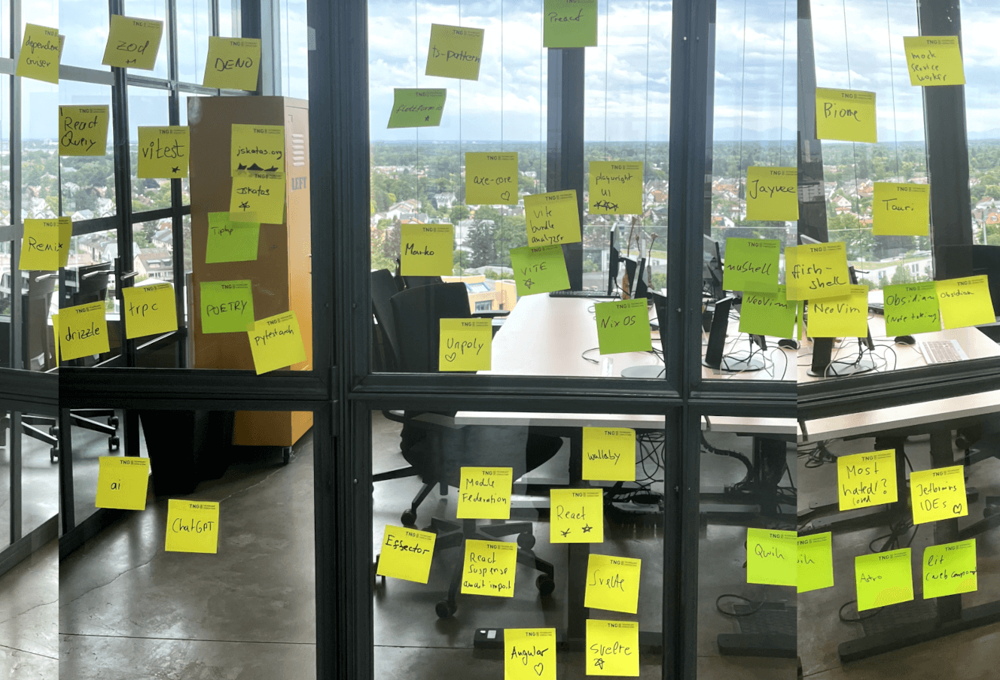

# Stars of JSCraftCamp

# JS Libs

https://github.com/colinhacks/zod

https://tanstack.com/query/latest/docs/framework/react/overview

https://github.com/gvergnaud/ts-pattern

https://flottform.io/

https://effector.dev/

## Learning

https://jskatas.org/

## Backend

https://orm.drizzle.team/

https://trpc.io/

## Mobile / Cross Platform

https://tauri.app/

## Testing

https://vitest.dev/

https://mswjs.io/

https://github.com/dequelabs/axe-core

https://wallabyjs.com/

https://playwright.dev/

## Data

https://github.com/jvalue/jayvee

## Tooling / Building / Bundling / Package Management

https://github.com/sverweij/dependency-cruiser

https://github.com/KusStar/vite-bundle-visualizer

https://nixos.org/

https://github.com/module-federation

https://biomejs.dev/

## Shell / Terminals

https://fishshell.com/

https://www.nushell.sh/

https://www.warp.dev/

## Frameworks

https://angular.io/

https://svelte.dev/

https://react.dev/

https://react.dev/reference/react/Suspense

https://qwik.dev/

https://astro.build/

https://preactjs.com/

https://remix.run/

## Web Components

https://lit.dev/

## JS Engine

https://deno.com/

## HTML

https://github.com/unpoly/unpoly

## Python

https://python-poetry.org/

https://pypi.org/project/pytestarch/

## Other

https://obsidian.md/

https://chatgpt.com/

https://www.jetbrains.com/ides/